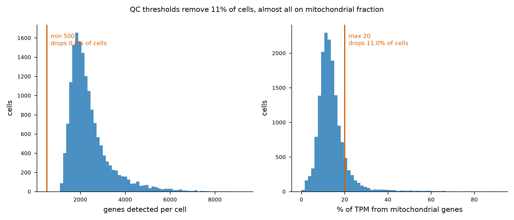
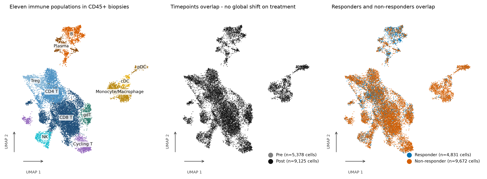
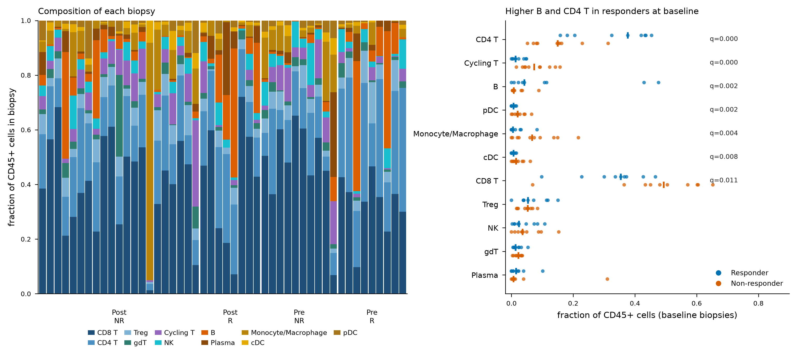
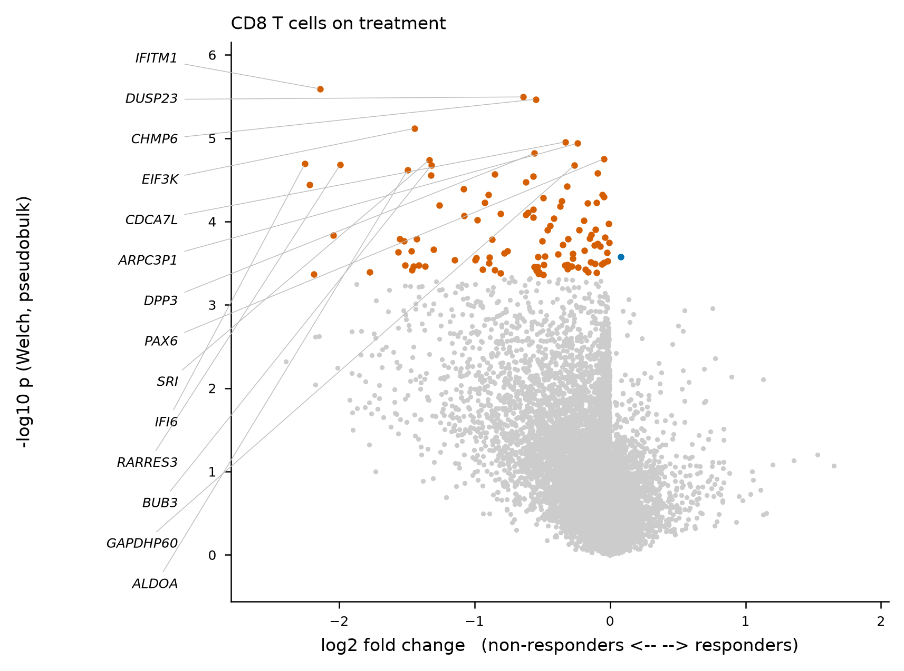
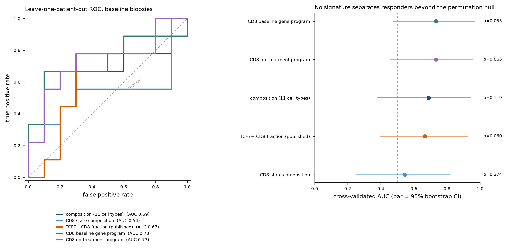

# Immune composition and transcriptional state in melanoma biopsies before and during checkpoint blockade

**Dataset:** GEO [GSE120575](https://www.ncbi.nlm.nih.gov/geo/query/acc.cgi?acc=GSE120575) — Sade-Feldman et al., *Cell* 2018 (PMID 30388456)
**Analysis:** `bioinfo-291`, reproducible via `python workflows/run_pipeline.py`

---

## 1. Headline findings

1. **Treatment does not detectably reshape the immune compartment.** Across 48 biopsies no
   cell type changes abundance between baseline and on-treatment at FDR < 0.05 (smallest
   adjusted p = 0.44). The nominally largest effect, an expansion of conventional dendritic
   cells (odds ratio 2.14, raw p = 0.058), does not survive correction.
2. **Baseline composition, by contrast, separates responders sharply.** Seven of eleven
   populations differ between responder and non-responder biopsies *before* treatment, led by
   B cells (OR 10.1, FDR 0.002) and CD4 T cells (OR 3.18, FDR 1e-4) in responders, against
   cycling T cells (OR 0.20), monocytes/macrophages (OR 0.16), pDC (OR 0.20) and cDC (OR 0.25)
   in non-responders.
3. **Non-responder CD8 T cells carry a chronic interferon program on treatment.** 109 genes
   differ in CD8 T cells between responders and non-responders during therapy; all but one are
   elevated in non-responders, and the set is dominated by interferon-stimulated and
   antigen-processing transcripts (*IFI6*, *IFITM1*, *IFITM2*, *UBE2L6*, *RARRES3*, *PSME1*,
   *HLA-DPA1*, *CD38*).
4. **No baseline signature predicts response beyond chance at this sample size.** The best of
   five candidates reaches a cross-validated AUC of 0.73, with a 95% bootstrap interval of
   0.48–0.96 and a permutation p of 0.055. These are hypothesis-generating, not a classifier.

---

## 2. Why this study

The brief asked for single-cell data comparing tumour biopsies before and after immunotherapy.
53 GEO series matched a search for human scRNA-seq of checkpoint blockade with longitudinal
sampling; GSE120575 was selected because it is the only one combining all three requirements:
paired pre/on-treatment **tumour** biopsies (not blood), a per-biopsy response annotation, and a
public expression matrix. Alternatives considered and set aside: GSE207422 (NSCLC neoadjuvant,
no baseline/on-treatment pairing within patient), GSE200996 (HNSCC, largely peripheral blood),
GSE179994 (NSCLC, response labels not per biopsy), GSE169246 (TNBC, no response stratification
in the deposited annotation).

Raw reads for GSE120575 are controlled-access (dbGaP phs001680.v1.p1). This analysis uses only
the two public supplementary files: the processed expression matrix and its per-cell annotation.

---

## 3. Data and design

16,291 CD45+ cells, Smart-seq2, from 48 biopsies of 32 melanoma patients.

| | Responder | Non-responder | total |
|---|---|---|---|
| **Baseline (Pre)** | 9 | 10 | 19 |
| **On-treatment (Post)** | 8 | 21 | 29 |

Eleven patients contributed biopsies at both timepoints (P1, P2, P3, P4, P6, P7, P8, P12, P15,
P20, P28). Therapy was anti-PD1, anti-CTLA4, or the combination.

Two properties of the annotation shaped the analysis and are easy to miss:

- **Response is labelled per biopsy, not per patient.** Three patients carry discordant labels
  across their biopsies (P1 and P5 have one responding and one non-responding on-treatment
  lesion; P4 is non-responder at baseline and responder on treatment). The published labels are
  used as given, and cross-validation groups by patient so a patient never appears in both
  training and test folds.
- **991 cells came from lineage-enriched sorts, not the unbiased CD45+ sort.** The expression
  file's second header row preserves suffixes (`_T_enriched`, `_myeloid_enriched`) that the
  annotation file drops: 873 T-cell-enriched and 118 myeloid-enriched cells across nine
  on-treatment biopsies. Their cell-type proportions are set by the sort, so they are **excluded
  from every composition analysis** (leaving 13,652 cells, all 48 biopsies still usable) and
  retained only for expression analyses.

The matrix is `log2(TPM + 1)`, not raw TPM — reconstructed per-cell totals come to 993k against
an expected 1e6, the shortfall being genes dropped at ingest. It is rescaled to natural log by a
single exact multiply (`ln(x+1) = log2(x+1) · ln2`) so scanpy's fold-change convention holds, and
is never re-normalised.

---

## 4. Methods

**QC.** Genes detected in fewer than 10 cells were dropped at ingest (36,602 retained). Cells
required ≥500 detected genes and ≤20% mitochondrial TPM. The gene filter removed nothing (the
lowest-complexity cell had 1,093 genes); the mitochondrial filter removed 1,788 cells, leaving
**14,503 (89.0%)**.



**Atlas.** 2,000 highly variable genes, 30 PCs, Harmony integration over patient, Leiden at
resolution 1.0 → 20 clusters. Cluster 0 was a genuine NK/T mixture (only 25% of its cells were
CD3+ and NK-marker-negative) and was sub-clustered at resolution 0.4 into three NK sub-clusters
(565 cells) and one CD8 arm (345 cells). Integration was checked rather than assumed: every
cluster draws from at least 22 of 32 patients, minimum normalised patient entropy 0.71, maximum
single-patient share 0.39 (`results/cluster_patient_entropy.csv`).

**Annotation.** Canonical marker panels for the CD45+ compartment, cross-checked against
CELLxGENE CellGuide canonical marker lists, scored per cell and averaged per cluster; non-immune
panels were included so a contaminating melanocytic or stromal cluster would be caught rather
than mislabelled (none was). Per-cluster evidence is in `results/cluster_annotation_evidence.csv`.

**Differential abundance.** Each cell type is modelled as cells-of-type versus cells-of-other per
biopsy with a binomial GLM, standard errors clustered on patient. The sandwich estimator absorbs
both overdispersion and the correlation between repeat biopsies of one patient. The biopsy, never
the cell, is the unit of inference. Benjamini-Hochberg across cell types within each contrast.

**Differential expression.** Pseudobulk profiles are averaged to one per patient per timepoint,
then compared with Welch's t-test and BH correction within each cell type × contrast.

**Signatures.** Five candidates evaluated on baseline biopsies by leave-one-patient-out
cross-validation with ridge logistic regression. Gene selection, standardisation and model
fitting all happen inside each fold; for the on-treatment-derived program the held-out patient is
removed from the selection set too, since 11 patients appear at both timepoints. Each AUC carries
a percentile bootstrap CI and a permutation null run through the identical pipeline.

### Deviations from the original plan

- **DESeq2 was not used.** Its negative-binomial model is a model of counts; GSE120575 publishes
  only TPM, and the raw reads are controlled-access. Rounding TPM into a count matrix would give
  confident output from a misspecified variance model. Pseudobulk profiles are compared on the log
  scale they already occupy instead.
- **propeller was not used.** It is an R/limma routine; the binomial GLM with patient-clustered
  robust errors is the equivalent treatment available in this stack, and handles repeat biopsies
  explicitly.
- **Permutations reduced from 1,000 to 200** at the user's direction, resolving p to about 0.005.
  The bootstrap intervals, not the null, are the limiting uncertainty here.
- **Assumption diagnostics were not run** (no formal tests of binomial dispersion or normality of
  pseudobulk residuals).

---

## 5. Results

### 5.1 Eleven immune populations



| Population | Cells | | Population | Cells |
|---|---|---|---|---|
| CD8 T | 5,688 | | Treg | 791 |
| CD4 T | 2,945 | | γδ T | 734 |
| B | 1,088 | | NK | 565 |
| Monocyte/Macrophage | 895 | | Plasma | 396 |
| Cycling T | 866 | | pDC | 284 |
| | | | cDC | 251 |

The compartment is T-cell dominated, as expected for a CD45+ sort of melanoma. Timepoint and
response do not produce visibly distinct regions of the embedding — consistent with the
composition result below, and a useful check that the integration did not encode the design.

### 5.2 Which populations expand or contract with treatment

**No cell type changes significantly between baseline and on-treatment.** Smallest adjusted
p-value across eleven populations is 0.44. Direction and magnitude of the nominal effects:

| Population | Pre | Post | Odds ratio | raw p | FDR |
|---|---|---|---|---|---|
| cDC | 0.014 | 0.020 | 2.14 | 0.058 | 0.44 |
| pDC | 0.016 | 0.022 | 1.91 | 0.121 | 0.44 |
| CD4 T | 0.233 | 0.190 | 0.74 | 0.174 | 0.44 |
| γδ T | 0.021 | 0.031 | 1.68 | 0.242 | 0.44 |
| Monocyte/Macrophage | 0.049 | 0.075 | 2.22 | 0.319 | 0.44 |
| NK | 0.047 | 0.035 | 0.78 | 0.324 | 0.44 |

The within-patient analysis restricted to the eleven patients with paired biopsies points the
same way: the only population with a nominal within-patient shift is NK, contracting in 9 of 11
patients (median change −0.026, raw p = 0.032), which does not survive correction (FDR 0.35).
Full table: `results/differential_abundance_paired.csv`.

This is a negative result worth stating plainly: at 48 biopsies, gross compartment composition is
not where the treatment effect lives. Between-patient variation dominates (left panel below).

### 5.3 Composition before treatment separates responders



Seven of eleven populations differ between responder and non-responder **baseline** biopsies:

| Population | Responder | Non-responder | Odds ratio | FDR | Direction |
|---|---|---|---|---|---|
| CD4 T | 0.332 | 0.145 | 3.18 | 0.0001 | higher in responders |
| Cycling T | 0.021 | 0.080 | 0.20 | 0.0001 | higher in non-responders |
| B | 0.137 | 0.020 | 10.14 | 0.0016 | higher in responders |
| pDC | 0.006 | 0.025 | 0.20 | 0.0016 | higher in non-responders |
| Monocyte/Macrophage | 0.018 | 0.078 | 0.16 | 0.0040 | higher in non-responders |
| cDC | 0.006 | 0.020 | 0.25 | 0.0078 | higher in non-responders |
| CD8 T | 0.327 | 0.473 | 0.49 | 0.0105 | higher in non-responders |

The B-cell result is the largest effect in the study and is consistent with the independent
literature on intratumoural B cells and tertiary lymphoid structures predicting checkpoint
response. The CD8 result cuts against a naive "more CD8 is better" expectation: responders had a
*lower* CD8 fraction at baseline, with a correspondingly higher CD4 and B fraction — the
composition is shifted, not uniformly more lymphoid.

By the on-treatment timepoint the separation is gone: no population differs between responders
and non-responders at FDR < 0.05 (smallest adjusted p 0.11, monocyte/macrophage).

Two caveats sit on this table. Response is biopsy-level, and nine responder versus ten
non-responder biopsies is a small comparison; the odds ratios are count-weighted, so a large
biopsy pulls harder than a small one. In 8 of 102 rows across all contrasts the count-weighted
model and the unweighted mean of proportions disagree in sign — those rows are flagged in the
`unweighted_mean_agrees` column of `results/differential_abundance.csv`.

### 5.4 Marker genes

Wilcoxon tests of each population against all others produced 402,622 gene × cell-type rows;
275 genes pass the FDR < 0.05 and log2FC ≥ 0.5 filter as top markers
(`results/markers_cell_type_top.csv`). The top markers recover textbook identities independently
of the panels used to assign them, which is the point of computing them:

| Population | Leading markers |
|---|---|
| CD8 T | *CCL5, CD8A, NKG7, KLRK1, CD8B, CST7, PRF1* |
| CD4 T | *IL7R, TCF7, SPOCK2, CD4, TNFRSF25* |
| Treg | *FOXP3, IL32, TNFRSF18, IL2RA, BATF, CTLA4, TIGIT* |
| γδ T | *TRDC, TRGC2, TRDV1, TRGC1, GZMK* |
| NK | *GNLY, CTSW, NKG7, PRF1, KLRD1, KLRF1* |
| B | *CD79A, MS4A1, IGHM, BCL11A, CD22, BANK1, CD19* |
| Plasma | *IGHG1, IGHG3, IGKC, MZB1, POU2AF1* |
| Monocyte/Macrophage | *TYROBP, FCER1G, IFI30, CD68, LYZ, CTSB* |
| cDC | *HLA-DRA, HLA-DPA1, CST3, CD74, IFI30* |
| pDC | *PLD4, IL3RA, TCF4, LILRA4, BCL11A, SERPINF1* |
| Cycling T | *STMN1, HMGN2, TUBB, TYMS, MKI67, RRM2* |

### 5.5 Differential expression within cell types

378,541 gene-level tests across contrasts and cell types; 171 pass FDR < 0.1, concentrated in
three places:

| Contrast | Cell type | Genes at FDR < 0.1 |
|---|---|---|
| Responder vs non-responder, on treatment | CD8 T | 109 |
| Responder vs non-responder, on treatment | Treg | 33 |
| Responder vs non-responder, on treatment | CD4 T | 1 |
| Post vs Pre | γδ T | 26 |
| Post vs Pre | pDC | 2 |



The CD8 result is strikingly one-sided: 108 of 109 genes are higher in non-responders. The
program is interferon-stimulated and antigen-processing — *IFI6* (log2FC −2.3), *HLA-DPA1*
(−2.2), *CD38* (−2.2), *IFITM1* (−2.1), *UBE2L6* (−2.0), *RARRES3* (−2.0), *IFITM2* (−1.8),
*PSME1* (−1.5) — the transcriptional shape of chronic rather than acute interferon exposure,
which is an established axis of checkpoint resistance. It is corroborated from the independent
composition analysis: the CD8 interferon-stimulated *state* is one of the baseline populations
depleted in responders.

In Treg, *TIGIT* is elevated in non-responders on treatment (log2FC −1.4) alongside *IFI6*
(−2.9), pointing at the same interferon axis in a second compartment.

### 5.6 Candidate response signatures



All five candidates were evaluated on the same 19 baseline patients (9 responders) by
leave-one-patient-out CV:

| Signature | Features | AUC | 95% CI | Permutation p |
|---|---|---|---|---|
| CD8 baseline gene program (nested selection) | 50 | **0.733** | 0.48–0.96 | 0.055 |
| CD8 on-treatment program scored at baseline | 50 | 0.733 | 0.46–0.95 | 0.065 |
| Whole-compartment composition | 11 | 0.689 | 0.38–0.95 | 0.119 |
| TCF7+ fraction of CD8 cells *(published comparator)* | 1 | 0.667 | 0.40–0.92 | 0.060 |
| CD8 state composition | 7 | 0.544 | 0.25–0.82 | 0.274 |

**Nothing clears the permutation null at α = 0.05, and every bootstrap interval includes 0.5.**
The honest reading is that 19 baseline patients cannot establish a predictive signature, however
clear the group-level composition differences are — a point worth separating from §5.3, where the
same data gives FDR 1e-4 differences. Group separation and individual prediction are different
questions, and this dataset answers only the first.

Two observations survive as hypotheses worth testing in a larger cohort:

- The **TCF7+ fraction of CD8 cells** reproduces the published direction — 0.374 in responders
  versus 0.244 in non-responders — from a single feature, and ranks fourth here only because it
  is not fitted to the data.
- The **on-treatment interferon program scores as well at baseline as a program selected at
  baseline** (both AUC 0.733), which would suggest the resistance-associated state is present
  before therapy rather than induced by it. With a permutation p of 0.065 this is a lead, not a
  finding.

---

## 6. Limitations

1. **Sample size governs everything above.** Nineteen baseline and 29 on-treatment biopsies; the
   responder arm on treatment is 8 biopsies. Negative results here bound the effect size that
   this study could have detected, they do not establish absence.
2. **Response is annotated per biopsy.** Three patients carry discordant labels across lesions,
   which is biologically real but means "responder" is a property of the sampled lesion.
3. **No counts.** All expression analysis rests on TPM, which rules out count-based DE models and
   their variance shrinkage.
4. **Smart-seq2 depth and composition.** Plate-based sorting gives ~2,100 genes per cell at a
   median 12.7% mitochondrial content, and 20% of the dataset's cells sit above 16% mitochondrial
   fraction; the 20% threshold is a judgement call that removed 11% of cells.
5. **Cell-state labels are this analysis's, not the authors'.** Cluster identity was assigned from
   marker panels at one clustering resolution; the state-level results in particular would move
   under a different resolution.
6. **One cohort, no external validation.** Every number here is in-sample.

---

## 7. Reproducing this

```bash
conda env create -f environment/environment.yml
conda activate icb-scrna
python workflows/run_pipeline.py --config configs/analysis.yaml
pytest
```

Stages are skipped when their outputs exist; `--force` overrides, `--stage NAME` runs one. The
download stage fetches both GEO files (127 MB) and records their SHA-256 in
`data/metadata/raw_download_manifest.json`. Full runtime from scratch is roughly 20 minutes on 8
CPU cores, dominated by matrix ingest (~4 min), Harmony and UMAP (~2.5 min), marker tests
(~1.5 min), pseudobulk DE (~1.5 min) and the signature permutations (~5.5 min).

Every parameter lives in `configs/analysis.yaml`; nothing is hardcoded in `src/`.

### Output index

| File | Contents |
|---|---|
| `results/differential_abundance.csv` | All abundance contrasts, cell-type and cell-state level |
| `results/differential_abundance_paired.csv` | Within-patient paired change, 11 patients |
| `results/markers_cell_type_top.csv` | Top 25 markers per population |
| `results/markers_cell_type_full.csv.gz` | All 402,622 gene × cell-type tests |
| `results/pseudobulk_de_significant.csv` | 171 genes at FDR < 0.1 |
| `results/pseudobulk_de_full.csv.gz` | All 378,541 pseudobulk tests |
| `results/signature_performance.csv` | AUC, bootstrap CI, permutation p per signature |
| `results/signature_scores_loo.csv` | Per-patient held-out scores |
| `results/cluster_annotation_evidence.csv` | Marker evidence behind each cluster call |
| `results/cluster_patient_entropy.csv` | Patient mixing per cluster |
| `results/qc_tally.csv` | Cells retained at each QC step |
| `data/processed/gse120575_annotated.h5ad` | Annotated AnnData (288 MB, regenerable) |
